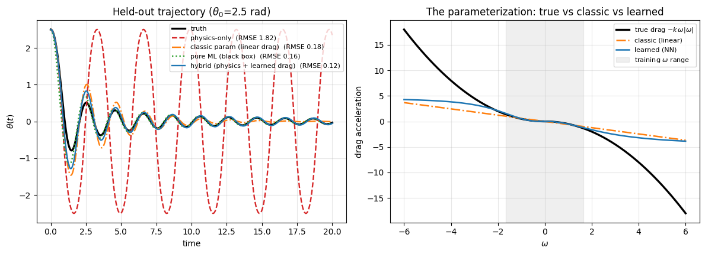
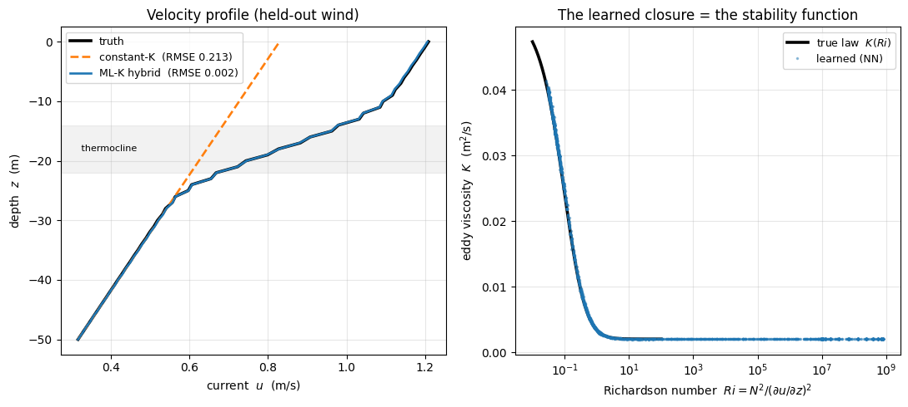
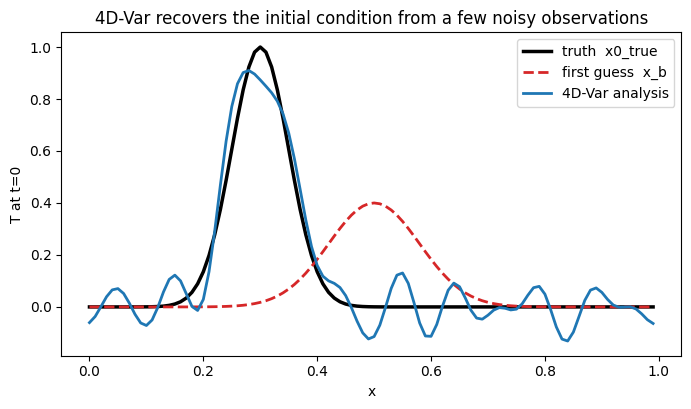

# Physics–ML Hybrid Modeling

Pedagogical, fully-runnable demonstrations of **hybrid physics + machine-learning
modelling** and **variational data assimilation** — the two pillars of modern
"AI for climate/ocean modelling":

1. keep a trustworthy **dynamical core**, and learn the uncertain **parameterization**
   (the closure) from data with a neural network;
2. fit a **model trajectory** to sparse, noisy observations with **4D-Var**, using a
   hand-written **adjoint** (backpropagation through the model's time steps).

Every notebook is self-contained, runs in seconds-to-minutes on a laptop with only
`numpy` / `scipy` / `scikit-learn` / `matplotlib`, and is written to make each concept
visible: the closure being replaced, the generalization test, the adjoint gradient check.
These are deliberately minimal systems — the point is to demonstrate the *designs* used by
research-scale systems (ML subgrid parameterizations, NeuralGCM-style hybrids, ECCO/SOSE
state estimation), not to compete with them.

## Notebooks

### 1. [Hybrid parameterization on a nonlinear pendulum](notebooks/01_hybrid_parameterization_pendulum.ipynb)

The closure problem in miniature. A damped nonlinear pendulum whose drag term is treated
as an "unresolved process". Four models are compared on a held-out, out-of-distribution
trajectory (initial angle 2.5 rad vs ≤ 1.2 rad in training):

| model | RMSE in θ(t) |
|---|---|
| physics-only (no drag) | 1.82 |
| classic parameterization (linear drag, least-squares) | 0.18 |
| pure ML (black-box NN for the full dynamics) | 0.16 |
| **hybrid (exact core + learned drag closure)** | **0.12** |

The hybrid wins because the known physics is hard-wired and exact at all amplitudes, so
the network only has to extrapolate the small closure — the physics-informed advantage.

### 2. [Learning an ocean turbulent-mixing closure](notebooks/02_ocean_mixing_learned_closure.ipynb)

The same design on a real ocean closure. A 1-D wind-driven ocean column with a trusted
dynamical core (vertical diffusion of momentum + quadratic bottom drag) and a
Richardson-number-dependent eddy viscosity `K(Ri)` (Pacanowski & Philander 1981) as the
unresolved truth. A small NN learns `K = NN(|shear|, N²)` (in log space) from
"high-resolution" training runs and is embedded back into the same solver:

- on a held-out wind stress, the learned closure cuts the velocity-profile RMSE by
  **~130×** relative to the best constant-K baseline;
- because the closure is a function of the *local state*, one trained network transfers
  across wind forcings it never saw (12–190× improvement), including extrapolation beyond
  the training range;
- the learned network recovers the Pacanowski–Philander stability function `K(Ri)`.

### 3. [Strong-constraint 4D-Var on 1-D advection–diffusion](notebooks/03_fourdvar_advection_diffusion.ipynb)

A twin experiment for variational data assimilation, built up from scratch: the
finite-difference propagator `x_{n+1} = A x_n`, sparse noisy observations, the 4D-Var
cost `J(x0)`, and a hand-written **adjoint model** (`A.T` swept backward, verified
against finite differences to ~1e-9) providing the gradient for L-BFGS.

- recovers the true initial condition from a deliberately wrong first guess;
- **bonus:** the same adjoint sweep yields the parameter gradient `dJ/dκ`, and recovers
  the model's diffusivity κ from observations — the same kind of control variable that
  ocean state estimation (ECCO/SOSE) adjusts.

## Author

**Youran Li** — liyouran.first@gmail.com

## License

[MIT](LICENSE)
